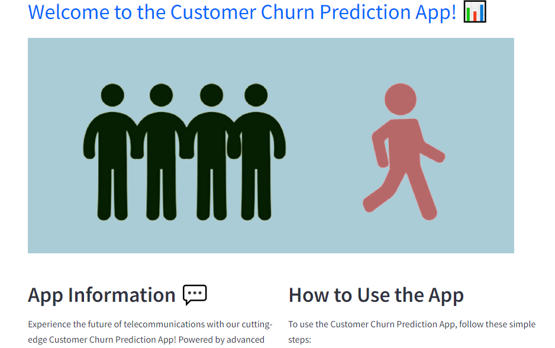
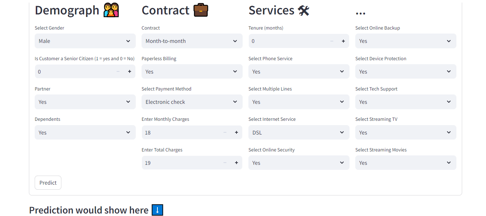
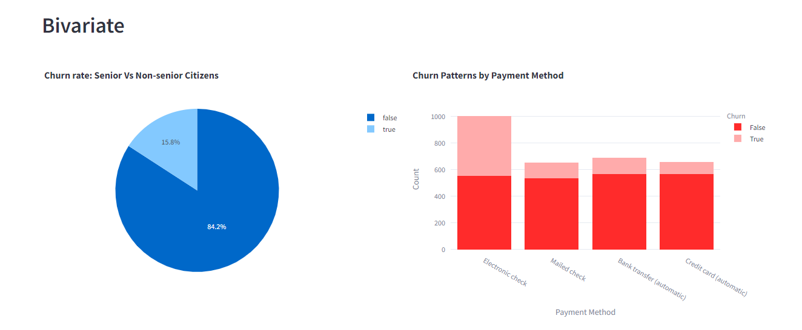

<div align="center">
  <h1><b>Customer Churn Prediction App</b></h1>
</div>

# 📕 Table of Contents

- [📕 Table of Contents](#Table-of-contents)
- [🎈 Introduction](#introduction)
- [♻ Data Features](#data-features)
- [📌 Demo](#demo)
- [💡 Prerequisites](#prerequisites)
- [🛠 Installation](#installation)
- [🧭 Usage](#usage)
   - [Important Notes](#important-notes)
- [🤝 Contributing](#contributing)
- [🔏 License](#license)
- [📝 Article](#article)
- [👤 Author](#author)

## 🎈 Introduction
This Streamlit web application is designed to offer insights and forecasts concerning customer churn. Leveraging a blend of data visualization techniques and machine learning models, it delves into customer data to anticipate potential churn occurrences. Users can actively engage with the machine learning model, explore data visualizations, and retain input values for future reference. By analyzing demographic details, service usage, and contract specifics, the application forecasts the probability of a customer churning.

## ♻ Data Features

- **Gender:** Whether the customer is male or female.
- **SeniorCitizen:** Whether a customer is a senior citizen or not.
- **Partner:** Whether the customer has a partner (Yes, No).
- **Dependents:** Whether the customer has dependents (Yes, No).
- **Tenure:** Number of months the customer has stayed with the company.
- **Phone Service:** Whether the customer has a phone service (Yes, No).
- **MultipleLines:** Whether the customer has multiple lines.
- **InternetService:** Customer’s internet service provider (DSL, Fiber Optic, No).
- **OnlineSecurity:** Whether the customer has online security.
- **OnlineBackup:** Whether the customer has online backup.
- **DeviceProtection:** Whether the customer has device protection.
- **TechSupport:** Whether the customer has tech support.
- **StreamingTV:** Whether the customer has streaming TV.
- **StreamingMovies:** Whether the customer has streaming movies.
- **Contract:** The contract term of the customer (Month-to-Month, One year, Two years).
- **PaperlessBilling:** Whether the customer has paperless billing (Yes, No).
- **Payment Method:** The customer’s payment method (Electronic check, mailed check, Bank transfer(automatic), Credit card(automatic)).
- **MonthlyCharges:** The amount charged to the customer monthly.
- **TotalCharges:** The total amount charged to the customer.
- **Churn:** Whether the customer churned or not (Yes or No).

## 📌 Demo
### Home Page

- This image showcases the home page of the Customer Churn Prediction App. Users are greeted with a user-friendly interface where they can access various features of the application.

### Application Interface

- Here, you can see the main interface of the application, which offers users the ability to interact with the machine learning model. Users can input data or select options to predict customer churn probability.

### Dashboard

- The dashboard provides users with insightful visualizations and key performance indicators (KPIs) related to customer churn. Users can explore different visualizations to gain a deeper understanding of the data and identify trends or patterns.

### 💡 Prerequisites

Before running this project, ensure you have the following dependencies installed:

- Python
- Streamlit
- pyodbc
- Pandas
- NumPy
- Matplotlib
- Seaborn
- Plotly
- Scikit-learn

## 🛠 Installation

1. Clone the repository:

   ```bash
   git clone https://github.com/Elphoxa/Customer-Churn-Prediction-App.git
   ```

2. Navigate into the repository directory:
   
    ```bash
    cd Customer-Churn-Prediction-App
    ```

3. Create a virtual environment

    ```bash
    python -m venv env
    ```

4. Activate the virtual environment

    ```bash
    virtual_env/Scripts/activate
    ```

5. Install dependencies:
    
    ```bash
    pip install -r requirements.txt
    ```
## 🧭 Usage
To run the Streamlit app, execute the following command:
    
    streamlit run Home.py
    
- The webpage will automatically open in your default browser
- Sign in to the app using the following credentials: username=deofis and password:abc123.
- Use the sidebar to navigate between different pages.
- Proceed to test a prediction by navigating to the prediction page.
- Input data or select options as prompted then hit the predict key
- **Important Notes: 💬** 
           
    - Access to the View Data page may be restricted as the secrets file is not committed to Git.
    - Exploratory Data Analysis (EDA): Provides visualizations to explore the dataset and understand
        the underlying patterns (Interactive dashboard allows you to interact with the data and explore different visualizations).
    - Key Performance Indicators (KPIs): Displays important metrics such as churn rate, average total charges, etc.

## 🤝 Contributing
If you'd like to contribute to this project, please follow these steps:

- Fork the repository.
- Create a new branch (git checkout -b feature/your-feature).
- Make your changes.
- Commit your changes (git commit -am 'Add some feature').
- Push to the branch (git push origin feature/your-feature).
- Create a new Pull Request.

## 🔏 License
This project is licensed under the MIT License. See the [Licence](./LICENSE) file for details.

## 📝 Article
Read the article on this project [Here](https://www.linkedin.com/pulse/streamlining-machine-learning-models-streamlit-users-omosigho-dqaaf/?trackingId=IkHlbY3YRI6yLj0qWbbMoA%3D%3D)

## 👤 AUTHOR
🤵 **Efosa Dave Omosigho**
- [GitHub Profile](https://github.com/Elphoxa) 🐙
- [LinkedIn Profile](https://www.linkedin.com/in/efosa-omosigho) 💼